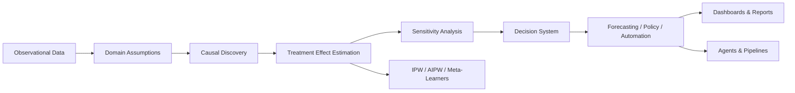

<!-- =====================================================================
     AADIP_THAPALIYA // ADVANCED PROFILE README
     Theme-aware, interactive, data-science system dashboard
====================================================================== -->

<!-- ============================ HERO ============================ -->
<picture>
  <source media="(prefers-color-scheme: dark)" srcset="https://raw.githubusercontent.com/Aadip-Thapaliya/Aadip-Thapaliya/main/assets/dark.svg">
  <source media="(prefers-color-scheme: light)" srcset="https://raw.githubusercontent.com/Aadip-Thapaliya/Aadip-Thapaliya/main/assets/light.svg">
  
</picture>

<div align="center">
  
</div>

<div align="center">
  <a href="https://linkedin.com/in/aadipthapaliya">
    
  </a>
  &nbsp;
  <a href="mailto:aadipthapaliya@gmail.com">
    
  </a>
  &nbsp;
  <a href="https://github.com/Aadip-Thapaliya">
    
  </a>
  &nbsp;
  
  &nbsp;
  
  &nbsp;
  
</div>

---

## 🖥️ TERMINAL

```bash
┌─[ aadip@berlin ]─[~]
└──╼ $ ./profile --mode=advanced --domain="causal-inference,time-series,ml-engineering"
```

```text
[ OK ] Loaded causal treatment-effect estimators
[ OK ] Loaded financial & energy forecasting benchmark
[ OK ] Loaded automated reporting pipelines
[ OK ] Loaded AI agents / reinforcement-learning experiments
```

---

## 🧠 ABOUT // SYSTEM PROFILE

```python
class AadipThapaliya:
    def __init__(self):
        self.role = "Digital Business & Data Science Student"
        self.location = "Berlin / Potsdam"
        self.mission = "Turn research into reproducible data products"
        self.focus = [
            "Causal Inference",
            "Time-Series Forecasting",
            "ML Engineering",
            "AI Systems"
        ]

    def build(self):
        return [
            "Automated forecasting pipelines",
            "Treatment-effect estimation",
            "Reproducible ML workflows",
            "Analytical reporting",
            "LLM / RL experiments"
        ]
```

> I build systems that connect research ideas with practical workflows: automated reporting, forecasting pipelines, causal estimation, and AI-assisted analysis.

---

## 🎯 CURRENT_FOCUS // PRIORITY MATRIX

| Priority | Domain | Active Build / Study |
|:---:|:---|:---|
| `P0` | **Causal Inference** | IPW, AIPW, meta-learners, sensitivity analysis, treatment-effect estimation |
| `P0` | **Time-Series Forecasting** | ARIMA, GARCH, LightGBM, Prophet, LSTM, N-BEATS, benchmarking workflows |
| `P1` | **ML Engineering** | Python pipelines, model evaluation, reproducible notebooks, automated reports |
| `P1` | **AI Systems** | LLM agents, reinforcement learning, end-to-end analytical tools |

---

## 🔬 RESEARCH_GRAPH // CAUSAL THINKING



---

## 🧰 TECH_MANIFEST // CORE STACK

<div align="center">

<picture>
  <source
    media="(prefers-color-scheme: dark)"
    srcset="https://skillicons.dev/icons?i=python,pytorch,tensorflow,sklearn,r,postgres,mysql,js,html,css,docker,git,github,vscode&theme=dark"
  >
  <source
    media="(prefers-color-scheme: light)"
    srcset="https://skillicons.dev/icons?i=python,pytorch,tensorflow,sklearn,r,postgres,mysql,js,html,css,docker,git,github,vscode&theme=light"
  >
  
</picture>

<br/>


&nbsp;

&nbsp;

&nbsp;


</div>

### Capability Map

| Layer | Technologies | Use Case |
|:---|:---|:---|
| **Modeling** | Python, PyTorch, TensorFlow, scikit-learn, R | Causal ML, forecasting, classification, benchmarking |
| **Data** | Pandas, NumPy, PostgreSQL, MySQL | Feature engineering, analytical datasets, pipelines |
| **Delivery** | Jupyter, Power BI, automated PDF reports | Dashboards, reporting, stakeholder communication |
| **Ops** | Git, GitHub, Docker, VS Code | Reproducibility, versioning, deployment workflows |

---

## 🚀 SELECTED_PROJECTS // DEPLOYMENTS

<div align="center">
  
</div>

<details open>
<summary><b>🧪 MODULE_01 // Causal Inference & ML</b></summary>

<br/>

| Component | Details |
|:---|:---|
| **Goal** | Estimate treatment effects and discover causal structure |
| **Methods** | Causal discovery, IPW, AIPW, meta-learners, sensitivity analysis |
| **Outcome** | Decision support beyond correlation |

</details>

<details>
<summary><b>📈 MODULE_02 // CLUE Automated Forecasting Pipeline</b></summary>

<br/>

| Component | Details |
|:---|:---|
| **Goal** | Make forecasting usable for non-technical users |
| **Methods** | Automated cleaning, forecasting, dashboarding, PDF reporting |
| **Outcome** | End-to-end forecasting and reporting workflow |

</details>

<details>
<summary><b>💹 MODULE_03 // Financial Time-Series Benchmark</b></summary>

<br/>

| Component | Details |
|:---|:---|
| **Goal** | Benchmark forecasting models across equities |
| **Methods** | ARIMA, GARCH, LightGBM, LSTM, N-BEATS, Prophet |
| **Outcome** | Model comparison framework for financial time series |

</details>

<details>
<summary><b>🌿 MODULE_04 // Varun Herbal ML Reporting</b></summary>

<br/>

| Component | Details |
|:---|:---|
| **Goal** | Automate agricultural / operational risk reporting |
| **Methods** | Python reporting pipeline, crop-risk classification, operational-risk reports |
| **Outcome** | Automated operational insights |

</details>

---

## 📡 TELEMETRY // GITHUB ANALYTICS

<div align="center">

<picture>
  <source
    media="(prefers-color-scheme: dark)"
    srcset="https://streak-stats.demolab.com/?user=Aadip-Thapaliya&hide_border=true&background=0A101F&stroke=22D3EE&ring=A78BFA&fire=10B981&currStreakLabel=22D3EE&sideLabels=94A3B8&currStreakNum=F8FAFC&sideNums=F8FAFC&dates=64748B&titleColor=22D3EE&card_width=1180"
  >
  <source
    media="(prefers-color-scheme: light)"
    srcset="https://streak-stats.demolab.com/?user=Aadip-Thapaliya&hide_border=true&background=FFFFFF&stroke=0891B2&ring=7C3AED&fire=059669&currStreakLabel=0891B2&sideLabels=475569&currStreakNum=0F172A&sideNums=0F172A&dates=94A3B8&titleColor=0891B2&card_width=1180"
  >
  
</picture>

<br/>

<picture>
  <source
    media="(prefers-color-scheme: dark)"
    srcset="https://github-readme-stats.vercel.app/api?username=Aadip-Thapaliya&show_icons=true&count_private=true&include_all_commits=true&hide_rank=true&hide_border=true&title_color=22D3EE&icon_color=A78BFA&text_color=94A3B8&bg_color=0A101F&card_width=500"
  >
  <source
    media="(prefers-color-scheme: light)"
    srcset="https://github-readme-stats.vercel.app/api?username=Aadip-Thapaliya&show_icons=true&count_private=true&include_all_commits=true&hide_rank=true&hide_border=true&title_color=0891B2&icon_color=7C3AED&text_color=0F172A&bg_color=FFFFFF&card_width=500"
  >
  
</picture>
<picture>
  <source
    media="(prefers-color-scheme: dark)"
    srcset="https://github-readme-stats.vercel.app/api/top-langs/?username=Aadip-Thapaliya&layout=compact&langs_count=8&hide_border=true&title_color=22D3EE&text_color=94A3B8&bg_color=0A101F&card_width=500"
  >
  <source
    media="(prefers-color-scheme: light)"
    srcset="https://github-readme-stats.vercel.app/api/top-langs/?username=Aadip-Thapaliya&layout=compact&langs_count=8&hide_border=true&title_color=0891B2&text_color=0F172A&bg_color=FFFFFF&card_width=500"
  >
  
</picture>

</div>

---

## 🏆 TROPHIES

<div align="center">
  
</div>

---

## 🐍 CONTRIBUTION_SNAKE

<div align="center">
<picture>
  <source
    media="(prefers-color-scheme: dark)"
    srcset="https://raw.githubusercontent.com/Aadip-Thapaliya/Aadip-Thapaliya/output/snake-dark.svg"
  >
  <source
    media="(prefers-color-scheme: light)"
    srcset="https://raw.githubusercontent.com/Aadip-Thapaliya/Aadip-Thapaliya/output/snake.svg"
  >
  
</picture>
</div>

---

## 📊 ACTIVITY_GRAPH

<div align="center">
<picture>
  <source
    media="(prefers-color-scheme: dark)"
    srcset="https://github-readme-activity-graph.vercel.app/graph?username=Aadip-Thapaliya&theme=react-dark&hide_border=true&bg_color=0A101F&color=22D3EE&line=A78BFA&point=10B981"
  >
  <source
    media="(prefers-color-scheme: light)"
    srcset="https://github-readme-activity-graph.vercel.app/graph?username=Aadip-Thapaliya&theme=minimal&hide_border=true&bg_color=FFFFFF&color=0891B2&line=7C3AED&point=059669"
  >
  
</picture>
</div>

---

## 📄 RESUME

<div align="center">
  <a href="https://github.com/Aadip-Thapaliya/Aadip-Thapaliya/blob/main/Lebenslauf_von_Aadip_Thapaliya.pdf">
    
  </a>
</div>

---

## 📡 UPLINK // CONNECT

<div align="center">
  <a href="https://linkedin.com/in/aadipthapaliya">
    
  </a>
  &nbsp;
  <a href="mailto:aadipthapaliya@gmail.com">
    
  </a>
  &nbsp;
  <a href="https://github.com/Aadip-Thapaliya">
    
  </a>
</div>

<div align="center">
  <sub>AADIP_OS • Berlin/Potsdam • Data Science / ML Engineering</sub>
</div>
